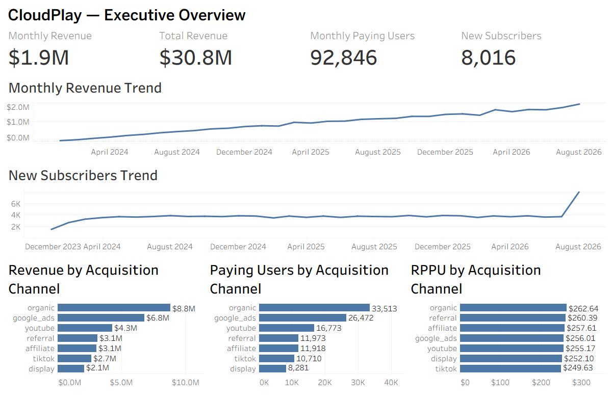
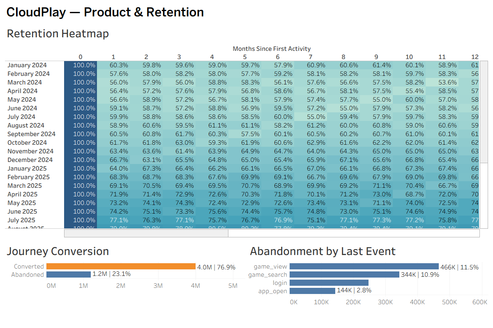

# CloudPlay — Product Analytics Case Study

## Overview

CloudPlay is an end-to-end product analytics portfolio project built around a **synthetic cloud gaming subscription service**.

The project covers the full analytics workflow: synthetic data generation, PostgreSQL data modeling and validation, KPI analysis, cohort retention, user journey analysis, acquisition-channel analysis, a simulated A/B experiment, and Tableau dashboards.

The final PostgreSQL dataset contains **35,778,306 rows** across six analytical tables.

> **Important:** CloudPlay is a simulated product and all data, business results, and experiment outcomes in this repository are synthetic.

## Tech Stack

- **PostgreSQL / SQL** — data storage, validation, KPI analysis, retention, journey analysis, and business analysis
- **Python / Jupyter Notebook** — synthetic data generation and A/B test analysis
- **pandas / NumPy / SciPy / statsmodels** — data processing and statistical testing
- **Tableau** — executive and product analytics dashboards

## Dataset

| Table | Rows | Purpose |
| --- | ---: | --- |
| `users` | 150,000 | User attributes and acquisition source |
| `subscriptions` | 250,000 | Subscription lifecycle |
| `payments` | 2,622,107 | Billing and monetization |
| `gaming_sessions` | 4,000,000 | Gameplay and technical experience |
| `events` | 12,000,000 | General behavioral events |
| `product_events` | 16,756,199 | Product journeys and funnel behavior |
| **Total** | **35,778,306** | |

The raw CSV files are intentionally excluded from GitHub because of their size. The generation workflow is available in `notebooks/data_generation.ipynb`.

## Business Questions

The analysis focuses on several product and business questions:

- How are revenue, paying users, successful payments, and new subscribers changing over time?
- How does gaming activity retention differ across user cohorts?
- Where do users abandon the journey before starting a gaming session?
- Do acquisition channels differ in monetization, payer conversion, and engagement?
- Are latency and queue time associated with user engagement?
- Could a redesigned game discovery experience improve journey-to-session conversion?

## Analysis

### 1. KPI and Revenue Analysis

Monthly KPIs were calculated for new subscribers, paying users, successful payments, and revenue.

A **new subscriber** is defined using the user's first-ever subscription rather than every subscription start, preventing returning subscribers from being counted as new users.

An unusual spike was identified in August 2026: **8,016 new subscribers**, compared with approximately **3,500–3,900** in preceding months. Investigation showed that **4,320 first subscriptions occurred on August 31**, the final observation date in the dataset. Excluding that date leaves **3,696** new subscribers, consistent with previous months.

The raw data was preserved and the anomaly documented rather than silently removed.

### 2. Gaming Activity Retention

Subscription renewal was initially considered for retention analysis, but subscription records contain overlapping subscriptions and same-date starts. They therefore do not form a reliable sequential renewal chain.

The final metric uses **gaming activity retention**:

- cohort = month of a user's first gaming session;
- retained in month N = at least one gaming session in that calendar month;
- users are counted once per activity month;
- retention is non-continuous, so a user can return after an inactive month.

Newer cohorts show substantially higher activity retention than early-2024 cohorts. For example, M1 retention increases from **56.03% for the March 2024 cohort** to **88.72% for January 2026** and **99.36% for June 2026**.

Recent cohorts have incomplete M3/M6/M12 observation windows because the dataset ends in August 2026. Missing future checkpoints are therefore not interpreted as zero retention.

### 3. User Journey and Funnel Analysis

The initial hypothesis assumed a sequential funnel:

`app_open → login → game_search → game_view → gaming_session`

Event validation showed that `login`, `game_search`, and `game_view` are not mandatory sequential steps. The analysis therefore avoids presenting them as a classical step-to-step funnel.

The robust high-level journey is:

**5.2M journeys → 4.0M gaming-session conversions**

- Journey-to-session conversion: **76.92%**
- Abandoned journeys: **1.2M (23.08%)**

Abandoned journeys by last recorded event:

| Last event | Abandoned journeys | Last-event drop-off rate |
| --- | ---: | ---: |
| `game_view` | 465,833 | 11.47% |
| `game_search` | 343,591 | 10.87% |
| `login` | 246,881 | 5.69% |
| `app_open` | 143,695 | 2.76% |

The dataset contains **20 distinct event paths**, showing that user behavior is better represented by multiple journey patterns than by one strict funnel. Differences between paths are descriptive associations, not causal effects.

### 4. Acquisition and Business Analysis

Acquisition channels differ much more in **scale** than in observed per-user behavior.

- Organic generated the highest total revenue: approximately **$8.80M**.
- Cumulative RPPU ranged only from **$249.63 (TikTok)** to **$262.64 (Organic)**.
- Payer conversion was approximately **79.5%–80.1%** across channels.
- Average sessions per user were also very similar, approximately **26.5–26.8**.

This suggests that, within the synthetic dataset, revenue differences across channels are driven primarily by channel scale rather than large differences in observed payer conversion, engagement, or cumulative RPPU.

Cumulative RPPU is not tenure-normalized, so it should not be interpreted as a controlled comparison of channel quality.

### 5. Gaming Experience Analysis

Technical experience variables were also evaluated.

Session-level latency:

- mean: **42.46 ms**
- median: **40 ms**
- range: **10–148 ms**

Session-level queue time:

- mean: **75.73 sec**
- median: **70 sec**
- range: **0–298 sec**

At the user level, Pearson correlation with total sessions was approximately:

- latency vs. sessions: **-0.0030**
- queue time vs. sessions: **-0.0018**

The dataset therefore does not support a meaningful **linear** relationship between either experience metric and total user sessions.

`disconnect_flag` has no variation: all 4 million gaming sessions are recorded as non-disconnected. It was therefore excluded from meaningful relationship analysis rather than forcing an interpretation.

## Simulated A/B Experiment

The SQL journey analysis motivated a simulated product experiment testing a redesigned game discovery and recommendation experience.

### Experiment design

- Control: current game discovery experience
- Treatment: redesigned discovery experience
- Primary metric: conversion to a gaming session
- Baseline conversion: **76.92%**
- MDE: **+1.00 percentage point**
- Significance level: **0.05**
- Power: **80%**
- Allocation: **50/50**
- Required sample: **27,439 users per group / 54,878 total**

### Results

| Metric | Control | Treatment |
| --- | ---: | ---: |
| Conversion | 76.92% | 78.20% |
| Mean session duration | 57.55 min | 57.56 min |

Observed conversion uplift was **+1.28 percentage points** (**+1.67% relative**).

A two-proportion z-test produced **p = 0.000316**, with a 95% confidence interval for the absolute uplift of **[+0.58 pp, +1.98 pp]**.

The confidence interval excludes zero but includes the predefined +1.00 pp MDE. The simulated experiment therefore supports a positive effect, but does not establish with 95% confidence that the true improvement is at least the full MDE.

The 50/50 allocation showed no Sample Ratio Mismatch (SRM p-value = **1.00**).

### Guardrail metric

Average session duration among converted users was used as a guardrail with a predefined non-inferiority margin of **-2 minutes**.

Treatment − Control:

- observed difference: **+0.01 min**
- 95% CI: **[-0.51, +0.53] min**

The lower confidence bound remains above the -2 minute margin, supporting non-inferiority under the simulated experiment design.

The experiment is fully synthetic and demonstrates experimentation methodology rather than causal evidence about a real product change.

## Tableau Dashboards

### Executive Overview



The executive dashboard summarizes revenue, paying users, new subscribers, monthly trends, and acquisition-channel performance.

### Product & Retention



The product dashboard combines cohort gaming-activity retention with journey conversion and abandonment analysis.

## Repository Structure

```text
CloudPlay/
├── images/
│   ├── executive_overview.png
│   └── product_retention.png
├── notebooks/
│   ├── data_generation.ipynb
│   └── ab_test_analysis.ipynb
├── SQL/
│   ├── 01_database_setup.sql
│   ├── 02_data_quality.sql
│   ├── 03_kpi_analysis.sql
│   ├── 04_retention.sql
│   ├── 05_funnel_analysis.sql
│   └── 06_business_analysis.sql
├── tableau/
│   └── CloudPlay_Analytics.twb
├── .gitignore
└── README.md
```

`data/` is kept locally and excluded from version control because the generated raw files are large.

## SQL Workflow

1. `01_database_setup.sql` — documents the PostgreSQL analytical schema and indexes.
2. `02_data_quality.sql` — validates row counts, IDs, referential integrity, dates, and metric ranges.
3. `03_kpi_analysis.sql` — monthly KPIs and investigation of the August 2026 subscriber spike.
4. `04_retention.sql` — gaming-activity cohort retention.
5. `05_funnel_analysis.sql` — journey conversion, abandonment, funnel validation, and path analysis.
6. `06_business_analysis.sql` — acquisition-channel monetization, engagement, payer conversion, latency, and queue-time analysis.

## Methodological Notes and Limitations

- All data is **synthetic** and findings should not be interpreted as real-world business performance.
- The analysis is observational except for the explicitly simulated A/B experiment.
- Associations in journey paths, acquisition channels, latency, and queue time are not causal estimates.
- Retention measures gaming activity rather than subscription renewal or payment retention.
- Recent retention cohorts are right-censored by the August 2026 observation window.
- Cumulative RPPU is not normalized for user tenure.
- Several variables are unusually uniform because of the synthetic generation process.
- The August 31 subscriber spike was documented as a potential boundary-related synthetic-data anomaly rather than removed.

## Reproducing the Project

1. Generate the synthetic datasets using `notebooks/data_generation.ipynb`.
2. Load the generated data into PostgreSQL using the schema documented in `SQL/01_database_setup.sql`.
3. Run the validation checks in `SQL/02_data_quality.sql`.
4. Run the analytical SQL scripts in order from `03` through `06`.
5. Run `notebooks/ab_test_analysis.ipynb` for the simulated experiment analysis.
6. Open the Tableau workbook in `tableau/CloudPlay_Analytics.twb`.

Because the raw dataset contains more than 35 million rows, generated CSV files are not stored in this repository.
